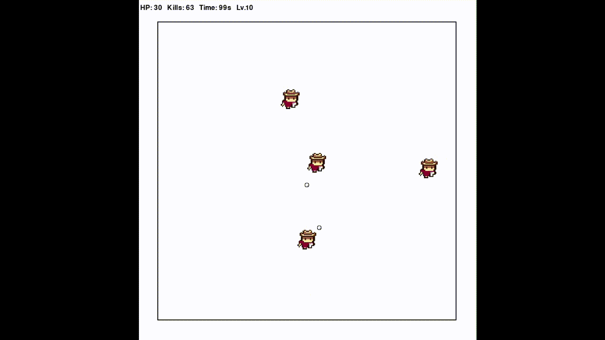
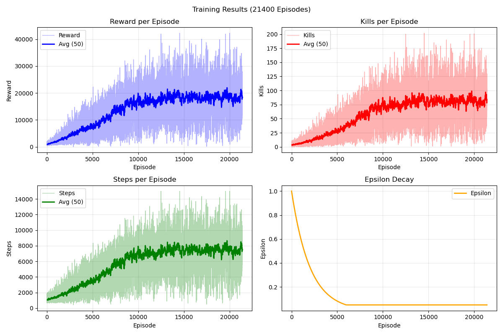

# Q-Learning Agent for Shooter Game

A reinforcement learning project in which a tabular Q-learning agent learns to autonomously play a top-down shooter game inspired by *Journey of the Prairie King* (the mini-game embedded in *Stardew Valley*). The agent navigates a 2D arena, dodges incoming enemies, and eliminates them with projectiles — entirely without human control.



---

## Overview

The game is implemented from scratch in Pygame and supports three modes:

| Mode | Description |
|---|---|
| `game` | Manual keyboard-controlled play |
| `train` | Headless training (no rendering) |
| `watch` | Load a trained model and watch the AI play |

The key algorithmic contribution is a **dual Q-table architecture** that decouples movement and shooting into two independent tables. This avoids the 81-action joint space that would otherwise be too sparse for tabular RL to converge, and allows each table to learn at its own pace.

---

## Project Structure

```
JPK/
├── assets/                  # Sprite assets (player, enemy, bullet)
├── game/
│   ├── main.py              # Entry point — set `flag` to switch mode
│   ├── game.py              # Core game loop and RL environment interface
│   ├── train.py             # Training script with checkpointing
│   ├── result.py            # Generates training curve plots
│   └── src/
│       ├── const.py         # All constants and hyperparameters
│       ├── player_agent.py  # Dual Q-table RL agent
│       ├── player.py        # Player entity (keyboard + agent control)
│       ├── enemy.py         # Enemy entity (chase AI)
│       ├── bullet.py        # Bullet projectile
│       ├── role.py          # Base class for animated characters
│       └── object.py        # Base class for all game entities
├── models/
│   ├── q_agent.pkl          # Latest training checkpoint
│   └── q_agent_best.pkl     # Best model (highest 100-ep rolling avg)
└── result/
    ├── training_result.png  # 4-panel training curves
    ├── demo.mp4              # Short clip of trained agent in action
    └── demo.gif              # Short demo of trained agent in action
```

---

## Game Environment

- **Arena**: 480×480 px bounded play area
- **Player**: 48×48 px, 30 HP, speed 0.2 px/ms, 300 ms shot cooldown, 1000 ms invincibility after hit
- **Enemies**: 48×48 px, 30 HP, speed 0.1 px/ms — spawn from all four edges and chase the player; spawn interval starts at 2000 ms and decreases by 100 ms every 10 s (floor: 1000 ms)
- **Bullets**: 10×10 px, 0.5 px/ms, 8 cardinal/diagonal directions
- **Episode length**: up to 15,000 steps (~240 s); ends early on player death

---

## Q-Learning Design

### Dual Q-Table Architecture

| | Move Q-Table | Shoot Q-Table |
|---|---|---|
| Responsibility | Navigate and dodge | Aim and fire |
| State | `(gx, gy, enemy_dir, enemy_dist, danger_count, aligned)` | `(enemy_dir, enemy_dist, can_shoot)` |
| State count | 13,824 | 72 |
| Actions | 9 (idle + 8 directions) | 9 (no-shoot + 8 directions) |

The shoot table converges fast (only 72 states), freeing the move table to develop a coherent spatial strategy without interference.

### Reward Shaping

**Move rewards**

| Event | Reward |
|---|---|
| Survive one step | +0.05 |
| Bullet trajectory aligned with enemy | +0.3 |
| Enemy killed | +15 × count |
| Proximity danger (<55 px) | 0 to −1.5 (linear) |
| Player death | −60 |

**Shoot rewards**

| Event | Reward |
|---|---|
| Enemy killed | +20 × count |
| Bullet hit (non-lethal) | +8 × count |
| Good aim (cos θ > 0.7) | +2.0 |
| Bad aim (cos θ < 0) | −1.0 |

### Informed Exploration

Rather than pure random exploration, the agent uses heuristic-biased epsilon-greedy:
- **Move**: 30% probability of fleeing the nearest enemy during exploration
- **Shoot**: 50% probability of aiming toward the nearest enemy during exploration

### Hyperparameters

| Parameter | Value |
|---|---|
| Learning rate α | 0.10 |
| Discount factor γ | 0.95 |
| ε start / min / decay | 1.0 / 0.05 / 0.9995 |
| Max episodes | 100,000 |
| Max steps per episode | 15,000 |

---

## Training Results



After 21,400 episodes:

- **Reward**: 50-episode rolling average grows to ~20,000 with an upward trend
- **Kills**: Average rises from 0 to ~75–90 kills per episode
- **Survival**: Average steps increase from ~1,500 to ~7,500–8,000
- **Epsilon**: Smoothly decays to 0.05 by ~episode 6,000

---

## Setup

**Requirements**: Python 3.x, Pygame, Matplotlib

```bash
pip install pygame matplotlib
pip install torch # for training
```

---

## Usage

All modes are launched via `game/main.py`. Edit the `flag` variable at the top of the file to select a mode:

```python
# game/main.py
flag = "game"    # manual play
flag = "train"   # headless training
flag = "watch"   # watch the trained agent
```

Then run:

```bash
python game/main.py
```

Alternatively, use `game/train.py` directly:

```bash
python game/train.py              # headless training
python game/train.py watch        # AI playback
python game/train.py train_render # training with rendering
```

To regenerate the training curve plot:

```bash
python game/result.py
```

---

## Technology Stack

- **Python 3** — core language
- **Pygame** — game engine and rendering
- **Matplotlib** — training visualization
- **Pickle** — model serialization
